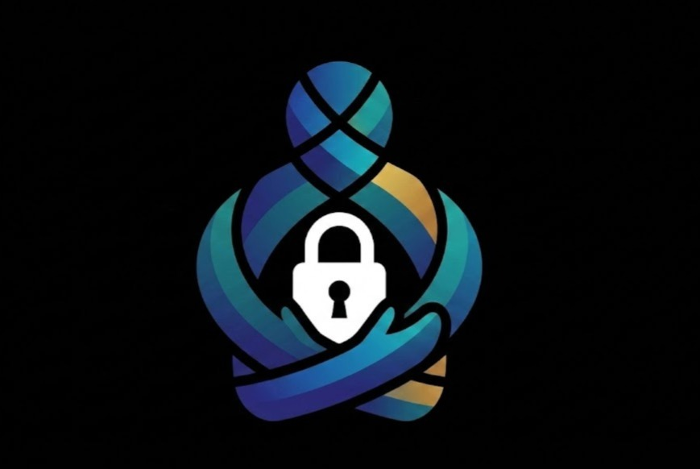
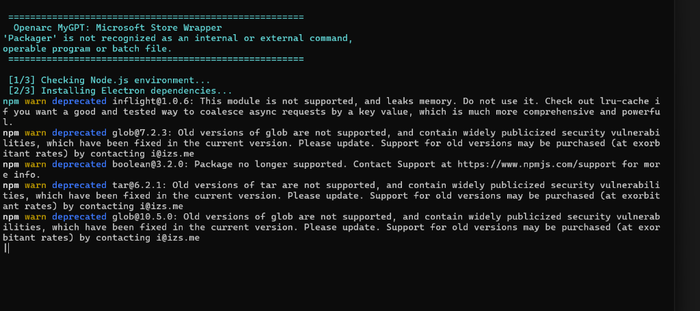
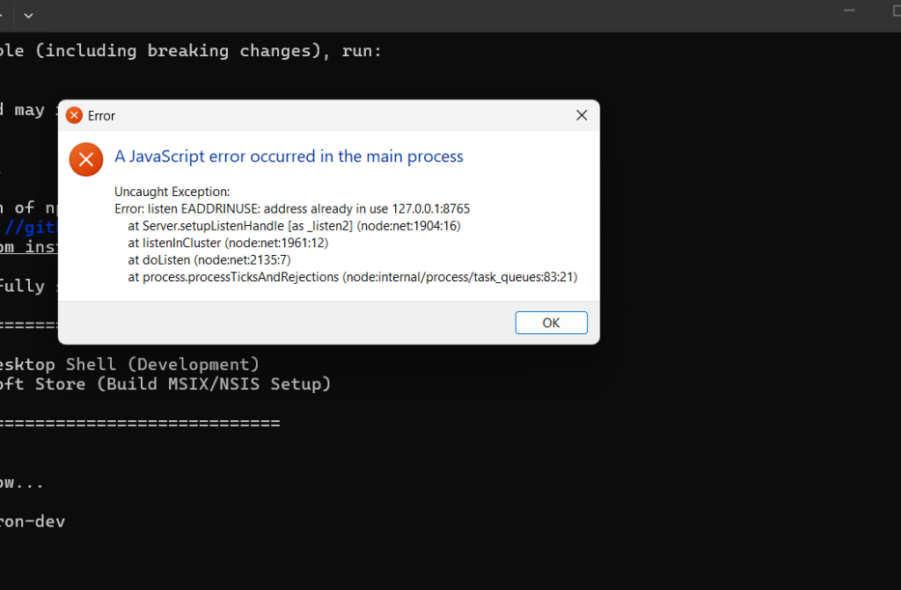
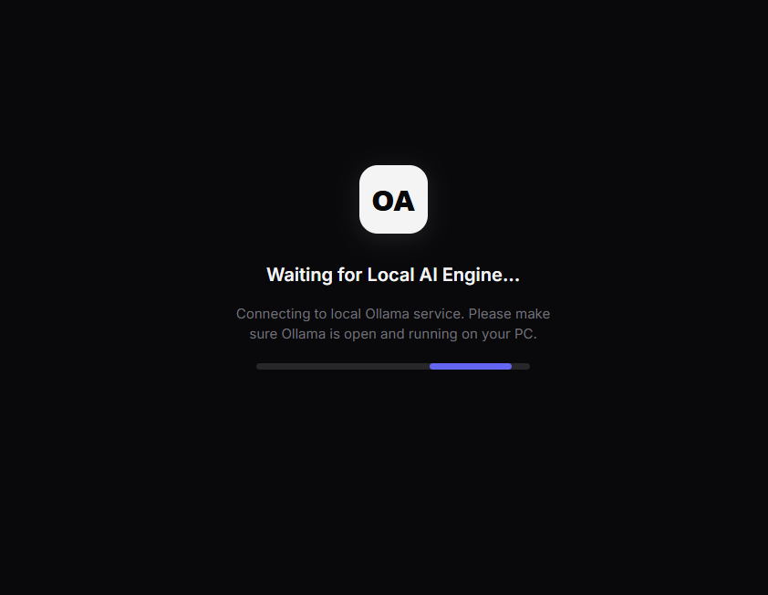

<div align="center">
  
  <h1>Openarc</h1>
  <p><strong>A Private, Local AI Chat Interface</strong></p>

  [](https://opensource.org/licenses/MIT)
  [](https://github.com/AREKG0)
</div>

<hr/>

## Overview

Openarc is a lightweight, high-performance web interface designed to seamlessly interact with local LLMs (Large Language Models) powered by [Ollama](https://ollama.com/). It provides a ChatGPT-like experience that runs 100% locally on your machine, ensuring absolute privacy, zero latency, and no subscription costs.

Built with a focus on premium aesthetics and responsive design, Openarc supports dynamic data visualization, markdown rendering, and rapid local API proxying.

## Screenshots

<div align="center">
  <h3>1. Claude-Style Minimalist Chat Interface</h3>
  
  
  <h3>2. Interactive Chart Rendering</h3>
  
  
  <h3>3. Rich Code Syntax Highlighting</h3>
  
</div>

## Features

- 🔒 **Absolute Privacy:** All data processing and inference happens locally. No data is sent to the cloud.
- 🎨 **Premium UI/UX:** A sleek, modern dark-mode interface with dynamic message bubbles and responsive layout.
- 📊 **Advanced Data Visualization:** Built-in robust JSON parsing and Chart.js integration for beautiful, interactive graphs.
- ⚡ **Zero Dependencies Frontend:** The frontend is built with vanilla HTML/CSS/JS for maximum speed.
- 🔧 **Ollama Proxy Server:** A lightweight Node.js backend to bypass CORS and securely route requests to your local Ollama instance.
- 🖥️ **Windows Integration:** Includes utility scripts for instant launching and desktop shortcut creation.

## Repository Structure

```
Openarc/
├── public/                 # Static frontend assets
│   ├── index.html          # Core user interface
│   └── assets/             # Logos and icons
├── scripts/                # Windows utility scripts
│   ├── launch.bat          # 1-click server and browser launch
│   └── create_shortcut.ps1 # Auto-generates a branded desktop shortcut
├── server.js               # Node.js API Proxy Server
└── package.json            # Project dependencies
```

## Quick Start

### Prerequisites
1. **Node.js** installed on your system.
2. **Ollama** installed and running (`localhost:11434`).

### Installation

1. Clone the repository:
   ```bash
   git clone https://github.com/AREKG0/openarc.git
   cd openarc
   ```
2. Install the lightweight dependencies:
   ```bash
   npm install
   ```

### Launching the App

**For Windows Users:**
Simply double-click `scripts\launch.bat`. This will automatically start the background server and open Openarc in your default browser.

**For Mac/Linux Users (or manual launch):**
1. Start the Node server:
   ```bash
   node server.js
   ```
2. Open your web browser and navigate to:
   ```
   http://localhost:8765
   ```

## Creating a Desktop Shortcut (Windows)

To create a branded shortcut on your desktop for easy access:
1. Open PowerShell as Administrator.
2. Run the included script:
   ```powershell
   .\scripts\create_shortcut.ps1
   ```

## Contributing

We welcome contributions! Please see our [Contributing Guidelines](CONTRIBUTING.md) for details on how to submit pull requests, report issues, and improve the codebase. 

Please ensure you adhere to our [Code of Conduct](CODE_OF_CONDUCT.md).

## License

This project is licensed under the MIT License. See the [LICENSE](LICENSE) file for details.

---
*Developed by [AREKG0](https://github.com/AREKG0).*
